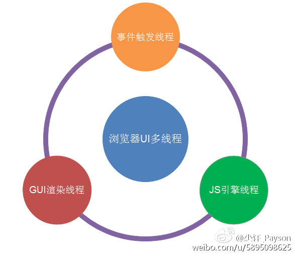

# 🎉 Hi Browser

<!-- 🎟🤹‍🤹‍🎭🎬🎼🥁🎸🚗🚌🚁✈️🚀⛵️🚤🛥🛳⛴⛽️🚦🚥🚧🚏🗽🗼🏰🎠
⛱🏖🏝🏜🌋🏂🏋️‍🤸🏻‍🤸🏼‍⛹️‍⛹️‍🤺🏄‍🗝🛍🎁🎊🎉🎀🛍📦🎏📯📄🗞🔈📣
⛺️🗻🗻🏔⛰🏤🏥🌆🌁☎️🎥⏰🛢⚒⛏💎💰💡⌛️💣🔪⚙️💉🌡🛁🛀🏿🔑
🏄‍🏊‍🏊‍🚣‍🏆🚴‍🥇🥈🥉🏅🎖🎗🏵🎫🌊🍎🍋🍓🍇🍉🍅🍆🥝🌽🍖🍗
🐴🐌🐝🐋🐬🐅🐆🐳🐪🐘🐏🕊🐇🐓🦌🐎🐿🐉🐲🌸🌼🌻🌞🌝🍄🌾
🍥🍦🍭🎂🍭🍿🍩🍪🌰🥜🍺🍻☕️🍶🍷🥂🥃🍹🍾🏈🏀🥊⛳️🥋🎋🌱
🔕🔔🔊🗯💭🇨🇳🎍⭐️✨🌈🌚☄️💥🔥☀️🌤⛅️🌥☁️🌦🌧⛈🌩🌨❄️⛲️
🍱🍛 -->

## 1. 浏览器种类

- Chrome / Chromium `WebKit`
- firefox `Gecko`
- Safari `WebKit`
- ie `💥Trident`
- opera `Blink`

## 2. 浏览器组成

1. `用户界面`。包括地址栏、前进/后退按钮、书签菜单等。除了浏览器主窗口显示的您请求的页面外，其他显示的各个部分都属于用户界面。

2. `浏览器引擎`。在用户界面和呈现引擎之间传送指令。
3. `渲染引擎`。负责显示请求的内容。如果请求的内容是 HTML，它就负责解析 HTML 和 CSS 内容，并将解析后的内容显示在屏幕上。
4. `网络层`。用于网络调用，比如 HTTP 请求。其接口与平台无关，并为所有平台提供底层实现。
5. `用户界面后端`。用于绘制基本的窗口小部件，比如组合框和窗口。其公开了与平台无关的通用接口，而在底层使用操作系统的用户界面方法。
6. `JavaScript 解释器。`用于解析和执行 JavaScript 代码。
7. `数据存储。`这是持久层。浏览器需要在硬盘上保存各种数据，例如 Cookie。新的 HTML 规范 (HTML5) 定义了“网络数据库”，这是一个完整（但是轻便）的浏览器内数据库。

>Cookie
localStorage
Session
IndexDb


## 3. 浏览器线程



### 3.1 浏览器中的线程介绍

  通常一个浏览器会至少存在三个线程：`JS引擎线程（用于处理JS）`、`GUI渲染线程（用于页面渲染）`、`浏览器时间触发线程（用于控制交互）`。
  而因为JS可以操作DOM元素，进而会影响到GUI的渲染结果，因此JS引擎线程与GUI渲染线程是互斥的。也就是说当JS引擎线程处于运行状态时，GUI渲染线程将处于冻结状态。
  JS引擎是基于事件驱动，采用的是单线程运行机制。即JS引擎会只会顺序的从任务列表中取任务，并执行。

### 3.2 一般情况下浏览器至少有三个常驻线程

（1）UI线程 `GUI渲染线程（渲染页面)`

（2）JS线程 `JS引擎线程（处理脚本)`

（3）事件(触发)线程 `事件触发线程（控制交互)`

> 包括浏览器有时候会开辟新的线程比如用完就扔的Http请求线程（Ajax）等等其他线程
它们共同构成了浏览器的UI线程
这些线程在UI线程的控制下井然有序的工作着
关于这个常驻线程网上观点不一致，各个浏览器实现可能也不一样，这里就不深考究了
>虽然我把js引擎线程放在了右下角，但是它是浏览器的主线程
而且`它和GUI渲染线程`是水火不容的，不能够同时工作
`道理很简单，因为它们都要影响DOM，如果 js 线程想要某个DOM的样式，渲染引擎必须停止工作`
🐯🙃🏃🎉⚠️

### 3.3 例子 SetTimeout/SetInternal

>其中 SetTimeout ：在指定的毫秒数后调用指定的代码段；SetInternal：在指定的时间间隔内（ms）循环调用指定的代码段。这两个函数内都涉及到时间计数器，也就是都涉及到一个类似与MFC定时器。JS引擎本身就只能单线程运行，因此定时器需要由其他的外部线程来启动。所以对JS引擎而言，定时器线程可以被视为异步线程。但当定时器时间到达后，所触发的事件则必须在任务列表中排队，等候JS引擎的处理。

  关于setTimeout下面有一个例子，可以帮助深入理解：

```ts
setTimeout(function () { while (true) { } }, 1000);
setTimeout(function () { alert('end 2'); }, 2000);
setTimeout(function () { alert('end 1'); }, 100);
alert('end');
```

 执行的结果是弹出‘end’‘end 1’，然后浏览器假死，就是不弹出‘end 2’。也就是说第一个settimeout里执行的时候是一个死循环，这个直接导致了理论上比它晚一秒执行的第二个settimeout里的函数被阻塞，这个和我们平时所理解的异步函数多线程互不干扰是不符的。


### 3.4 JS单线程

为什么`JavaScript是单线程 单线程就是同一时间只能干一件事`

> 那么JavaScript多线程不好吗，那效率多高啊 ? 不好

js设计出来就是为了与用户交互，处理DOM 
`如果JavaScript多线程了，那就必须处理多线程同步的问题`（依稀记得曾经被C++线程同步支配的恐怖） 
`假如js是多线程，同一时间一个线程想要修改DOM，另一个线程想要删除DOM 
问题就变得复杂许多，浏览器不知道听谁的，如果引入“锁”的机制，那就麻烦死了（那我就不学前端了(￣_,￣ )） `
这样一个`脚本语言`根本没有必要搞得那么复杂，所以`JavaScript诞生起就是单线程执行`

虽然H5提出了`Web Worker`，但是`它不能够操作DOM`，还是要`委托给大哥js主线程解决` 
这些子线程完全受主线程老大控制的（而且受很多限制），实际上`并没有改变JavaScript单线程的本质`

### 3.5 执行栈

我们先来看看什么是执行栈 
栈是`先进后出（FILO）的数据结构`
`执行栈`中存放正在执行的任务，`每一个任务叫做“帧”`
举个例子

```ts
function foo(c){
    var a = 1;
    bar(200);
}
function bar(d){
    var b = 2;
}
foo(100);
```

我们来看看执行栈发生了怎样的变化

- 最开始，代码没有执行的时候，`执行栈为空栈`
- foo函数执行时，创建了一帧，这帧中包含了形参、局部变量（预编译过程），然后把这一帧压入栈中
- 然后执行foo函数内代码，执行bar函数
- 创建新帧，同样有形参、局部变量，压入栈中
- bar函数执行完毕，弹出栈
- foo函数执行完毕，弹出栈
- 执行栈为空

`执行栈其实相当于js主线程（同步顺序执行）`

### 3.6 任务队列

`队列是先入先出（FIFO）的数据结构`
`js线程中还存在着一个任务队列`
任务队列包含了一系列待处理的任务 
`单线程就意味着所有任务需要一个接一个的执行，如果一个任务执行的时间太长，那后面的任务就不得不等着`
>就好比护士阿姨给排队的小朋友打针，如果最前面的小朋友一直滚针，那就一直扎，后面的小朋友就得等着（这比喻好像不恰当）
>可是如果最前面的小朋友晕针昏倒了
那么护士阿姨不可能坐那里了等到他醒来，应该先给后面的小朋友扎针
也就是相当于把那位小朋友“挂起”（异步）

所以，任务可以分为两种

- 同步任务
- 异步任务

`同步任务就是正在主线程执行栈中执行的任务（在屋子内打针的小朋友）`
`而异步任务是在任务队列等候处理的任务（在屋子外等候打针的小朋友）`
一旦执行栈中没有任务了，它就会从`执行队列`中获取任务执行

### 3.6 事件与回调

`任务队列是一个事件的队列`，IO设备（输入/输出设备）每完成一项任务，就会在`任务队列中添加事件处理`
用户`触发了事件`，也同样会`将回调添加到任务队列中去`
主线程执行`异步任务`，便是`执行回调函数（事件处理函数）`
只要执行栈一空，排在执行队列前面的处理函数便会被优先读取执行
`不过主线程会检查时间，某些事件需要到了规定时间才能进入主线程处理（定时器事件）`

### 3.7 简述 事件循环(Event Loop)

`Event Loop`


`主线程从执行队列不断地获取任务，这个过程是循环不断地，叫做“Event Loop”事件循环
同步任务总是会在异步任务之前执行
只有当前的脚本执行完，才能够去拿任务队列中的任务执行
前面也说到了，任务队列中的事件可以是定时器事件
定时器分为两种 setTimeout() 和 setInterval()
前者是定时执行一次，后者定时重复执行 
第一个参数为执行的回调函数，第二个参数为间隔时间（ms）`
来看这样一个例子

```ts
setTimeout(function(){
    console.log('timer');
}, 1000);
console.log(1);
console.log(2);
console.log(3);
```

这个没什么问题，浏览器打印的是

```ts
1 2 3 timer
```

但是这样呢

```ts
setTimeout(function(){
    console.log('timer');
}, 0);//0延时
console.log(1);
console.log(2);
console.log(3);
```

浏览器打印依然打印的是 `1 2 3 timer`
也许有同学知道，旧版浏览器，setTimeout定时至少是10ms（即便你设置了0ms），
`H5新规范是定时至少4ms`，改变`DOM也是至少16ms`
我们可以暂且认为是这个原因
那么我再改动一下代码

```ts
setTimeout(function(){
    console.log('timer');
}, 0);
var a = +new Date();
for(var i = 0; i < 1e5; i++){
    console.log(1);
}
var b = +new Date();
console.log(b - a);
```

这回够刺激了吧，输出10w次，我浏览器都假死了（心疼我chrome） 
不仅如此，我还打印了循环所用时间 
来看看控制台


输出了10w个1，用了将近7s
timer依然在最后打印
这就证明了我前面说的话: 同步任务总是会在异步任务之前执行 
只有我执行栈空了，才会去你任务队列中取任务执行

实例
最后我举一个例子加深一下理解

```ts
demo.onclick = function(){
    console.log('click');
}
function foo(a){
    var b = 1;
    bar(200);
}
function bar(c){
    var d = 2;
    click//伪代码 此时触发了click事件（这里我假装程序运行到这里手动点击了demo）
    setTimeout(function(){
        console.log('timer');
    }, 0);
}
foo(100);
```

怕大家蒙我就不写Ajax了
Ajax如果处理结束后（通过Http请求线程），也会将回调函数放在任务队列中
还有一点 click 那一行伪代码我最开始是想用demo.click()模拟触发事件
后来在测试过程中，发现它好像跟真实触发事件不太一样
它应该是不通过触发事件线程，而是存在于执行栈中，就相当于单纯地执行click回调函数
不过这只是我自己的想法有待考证，不过这不是重点，重点是我们理解这个过程，请大家不要吐槽我╰(￣▽￣)╭

下面看看执行这段代码时发生了什么（主要说栈和队列的问题，不会赘述预编译过程）

- 主线程开始执行，产生了栈、堆、队列
- demo节点绑定了事件 click ，交给事件触发线程异步监听
- 执行foo函数（之前同样有预编译过程），创建了帧包括foo函数的形参、局部变量压入执行栈中
- foo函数内执行 bar 函数，创建帧包括bar函数的形参、局部变量压入执行栈中
- 触发了click事件，事件触发线程将回调事件处理函数放到js线程的任务队列中
- 触发了定时器事件，事件触发线程立即（4ms）将回调处理函数放到 js 线程的任务队列中bar函数执行完毕，弹出栈
- foo函数执行完毕，弹出栈
- 此时执行栈为空
- 执行栈向任务队列中获取一个任务执行：click回调函数，输出‘click’
- 执行栈向任务队列中获取一个任务执行：定时器回调函数，输出‘timer’
- 执行结束
- 这里从任务队列里不断取任务的过程就是Event Loop

## 4. 🐯JS 事件循环详解

`大量摘抄`

### 4.1 JS 事件循环前言

这一次，彻底弄懂 JavaScript 执行机制
本文的目的就是要保证你彻底弄懂javascript的执行机制，如果读完本文还不懂，可以揍我。

不论你是javascript新手还是老鸟，不论是面试求职，还是日常开发工作，我们经常会遇到这样的情况：给定的几行代码，我们需要知道其输出内容和顺序。因为javascript是一门单线程语言，所以我们可以得出结论：

javascript是按照语句出现的顺序执行的
看到这里读者要打人了：我难道不知道js是一行一行执行的？还用你说？稍安勿躁，正因为js是一行一行执行的，所以我们以为js都是这样的：

```ts
let a = '1';
console.log(a);

let b = '2';
console.log(b);
```

然而实际上js是这样的：


```ts
setTimeout(function(){
    console.log('定时器开始啦')
});

new Promise(function(resolve){
    console.log('马上执行for循环啦');
    for(var i = 0; i < 10000; i++){
        i == 99 && resolve();
    }
}).then(function(){
    console.log('执行then函数啦')
});

console.log('代码执行结束');
```


依照js是`按照语句出现的顺序`执行这个理念，我自信的写下输出结果：

```ts
//"定时器开始啦"
//"马上执行for循环啦"
//"执行then函数啦"
//"代码执行结束"
```

去chrome上验证下，结果完全不对，瞬间懵了，说好的一行一行执行的呢？


我们真的要彻底弄明白javascript的执行机制了。

### 4.2 主要执行顺序

>`宏任务 --> 微任务 --> 宏任务 -->  微任务 -->[]`

- macro-task(宏任务)：包括**`整体代码script，setTimeout，setInterval, new Promise`**
- micro-task(微任务)：`Promise.then，process.nextTick`
- ⚠️`主要代码结构就是宏任务` 之后`执行微任务`


### 4.3 关于javascript

javascript是一门单线程语言，在最新的HTML5中提出了Web-Worker，但javascript是单线程这一核心仍未改变。所以一切javascript版的"多线程"都是用单线程模拟出来的，一切javascript多线程都是纸老虎！

### 4.4 javascript事件循环

既然js是单线程，那就像只有一个窗口的银行，客户需要排队一个一个办理业务，同理js任务也要一个一个顺序执行。如果一个任务耗时过长，那么后一个任务也必须等着。那么问题来了，假如我们想浏览新闻，但是新闻包含的超清图片加载很慢，难道我们的网页要一直卡着直到图片完全显示出来？因此聪明的程序员将任务分为两类：

- 同步任务
- 异步任务

当我们打开网站时，网页的渲染过程就是一大堆同步任务，比如页面骨架和页面元素的渲染。而像加载图片音乐之类占用资源大耗时久的任务，就是异步任务。关于这部分有严格的文字定义，但本文的目的是用最小的学习成本彻底弄懂执行机制，所以我们用导图来说明：


导图要表达的内容用文字来表述的话：

- 同步和异步任务分别进入不同的执行"场所"，同步的进入主线程，异步的进入Event Table并注册函数。
- 当指定的事情完成时，Event Table会将这个函数移入 Event Queue。
- 主线程内的任务执行完毕为空，会去Event Queue读取对应的函数，进入主线程执行。
- 上述过程会不断重复，也就是常说的Event Loop(事件循环)。

我们不禁要问了，那怎么知道主线程执行栈为空啊？js 引擎存在 monitoring process进程，会持续不断的检查主线程执行栈是否为空，一旦为空，就会去Event Queue那里检查是否有等待被调用的函数。

说了这么多文字，不如直接一段代码更直白：

```ts
let data = [];
$.ajax({
    url:www.javascript.com,
    data:data,
    success:() => {
        console.log('发送成功!');
    }
})
console.log('代码执行结束');
```

上面是一段简易的ajax请求代码：

1. `ajax`进入Event Table，注册`回调函数success`。
2. 执行console.log('代码执行结束')。
3. ajax事件完成，回调函数 success 进入Event Queue。
4. 主线程从Event Queue 读取回调函数 success 并执行。

>相信通过上面的文字和代码，你已经对js的执行顺序有了初步了解。接下来我们来研究进阶话题：setTimeout。

### 4.5 又爱又恨的 setTimeout

>大名鼎鼎的setTimeout无需再多言，大家对他的第一印象就是异步可以延时执行，我们经常这么实现延时3秒执行：

```ts
setTimeout(() => {
    console.log('延时3秒');
},3000)
```

渐渐的setTimeout用的地方多了，问题也出现了，有时候明明写的延时3秒，实际却5，6秒才执行函数，这又咋回事啊？

先看一个例子：

```ts
setTimeout(() => {
    task();
},3000)
console.log('执行console');
```

- 根据前面我们的结论，setTimeout是异步的，应该先执行console.log这个同步任务，所以我们的结论是：

```ts
//执行console
//task()
```

- 去验证一下，结果正确！然后我们修改一下前面的代码：

```ts
setTimeout(() => {
    task()
},3000)

sleep(10000000)
```

乍一看其实差不多嘛，但我们把这段代码在chrome执行一下，却发现控制台执行task()需要的时间远远超过3秒，说好的延时三秒，为啥现在需要这么长时间啊？

这时候我们需要重新理解setTimeout的定义。我们先说上述代码是怎么执行的：

`Important`

- `task()`进入`Event Table`并注册,计时开始。
- 执行`sleep`函数，很慢，非常慢，计时仍在继续。
- 3秒到了，计时事件`timeout`完成，task()进入`Event Queue`，但是`sleep也太慢了吧，还没执行完，只好等着。`
- `sleep终于执行完`了，`task()`终于从Event Queue进入了主线程执行。

上述的流程走完，我们知道`setTimeout`这个函数，是经过指定时间后，把要执行的任务(本例中为task())加入到Event Queue中，`又因为是单线程任务要一个一个执行，如果前面的任务需要的时间太久，那么只能等着，导致真正的延迟时间远远大于3秒`。

我们还经常遇到`setTimeout(fn,0)`这样的代码，0秒后执行又是什么意思呢？是不是可以立即执行呢？

答案是不会的，`setTimeout(fn,0)的含义是，指定某个任务在主线程最早可得的空闲时间执行，意思就是不用再等多少秒了，只要主线程执行栈内的同步任务全部执行完成，`栈为空就马上执行。举例说明：

```ts
//代码1
console.log('先执行这里');
setTimeout(() => {
    console.log('执行啦')
},0);
//代码2
console.log('先执行这里');
setTimeout(() => {
    console.log('执行啦')
},3000);
```

代码1的输出结果是：

```ts
//先执行这里
//执行啦
```

代码2的输出结果是：

```ts
//先执行这里
// ... 3s later
// 执行啦
```

关于setTimeout要补充的是，即便主线程为空，0毫秒实际上也是达不到的。根据HTML的标准，`最低是4毫秒`。有兴趣的同学可以自行了解。

### 4.6 又恨又爱的setInterval

上面说完了setTimeout，当然不能错过它的孪生兄弟setInterval。他俩差不多，只不过后者是循环的执行。`对于执行顺序来说，setInterval会每隔指定的时间将注册的函数置入Event Queue`，如果前面的任务耗时太久，那么同样需要等待。

唯一需要注意的一点是，对于`setInterval(fn,ms)`来说，我们已经知道`不是每过ms秒会执行一次fn，而是每过ms秒，会有fn进入Event Queue`。一旦setInterval的回调函数`fn`执行时间超过了`延迟时间ms`，那么就完全`看不出来有时间间隔了`。这句话请读者仔细品味。

让我们想象一个意外情况，比如说下面的setInterval

```ts
setInterval(function () {
    func(i++);
}, 100)
```

我们每100毫秒调用一次func函数，如果func的执行时间少于100毫秒的话，在遇到下一个100毫秒前就能够执行完：


但如果func的执行时间大于100毫秒，该触发下一个func函数时之前的还没有执行完怎么办？答案如下图所示，那么第二个func会在队列（这里的队列是指event loop）中等待，直到第一个函数执行完


如果第一个函数的执行时间特别长，在执行的过程中本应触发了许多个func怎么办，那么所有这些应该触发的函数都会进入队列吗？

不，只要发现队列中有一个被执行的函数存在，那么其他的统统忽略。如下图，在第300毫秒和400毫秒处的回调都被抛弃，一旦第一个函数执行完后，接着执行队列中的第二个，即使这个函数已经“过时”很久了。


还有一点，虽然你在setInterval的里指定的周期是100毫秒，但它并不能保证两个函数之间调用的间隔一定是一百毫秒。在上面的情况中，如果队列中的第二个函数时在第450毫秒处结束的话，在第500毫秒时，它会继续执行下一轮func，也就是说这之间的间隔只有50毫秒，而非周期100毫秒

### 4.7 Promise.then与 process.nextTick(callback)

传统的定时器我们已经研究过了，接着我们探究 Promise与 process.nextTick(callback)的表现。

Promise的定义和功能本文不再赘述，不了解的读者可以学习一下阮一峰老师的Promise。而process.nextTick(callback)类似node.js版的"setTimeout"，在事件循环的下一次循环中调用 callback 回调函数。

### 4.8 宏任务和微任务

> `我们进入正题，除了广义的同步任务和异步任务，我们对任务有更精细的定义：`

- macro-task(宏任务)：包括**整体代码script，setTimeout，setInterval, `new Promise`**
- micro-task(微任务)：Promise.then，process.nextTick

不同类型的任务会进入对应的`Event Queue`，比如`setTimeout`和`setInterval`会进入相同的Event Queue。

事件循环的顺序，决定js代码的执行顺序。进入整体代码(宏任务)后，开始第一次循环。接着执行所有的微任务。然后再次从宏任务开始，找到其中一个任务队列执行完毕，再执行所有的微任务。听起来有点绕，我们用文章最开始的一段代码说明：

```ts
setTimeout(function() {
    console.log('setTimeout');
})

new Promise(function(resolve) {
    console.log('promise');
}).then(function() {
    console.log('then');
})

console.log('console');
```

1. 这段代码作为宏任务，进入主线程。
2. 先遇到setTimeout，那么将其回调函数注册后分发到宏任务Event Queue。(注册过程与上同，下文不再描述)
3. 接下来遇到了Promise，new Promise立即执行，then函数分发到微任务 Event Queue。
4. 遇到console.log()，立即执行。
5. 好啦，整体代码script作为第一个宏任务执行结束，看看有哪些微任务？我们发现了 then在微任务 Event Queue里面，执行。
6. ok，第一轮事件循环结束了，我们开始第二轮循环，当然要从宏任务Event Queue开始。我们发现了宏任务`Event Queue`中setTimeout对应的回调函数，立即执行。
7. 结束。

事件循环，宏任务，微任务的关系如图所示：


### 4.9 实战分析

```ts
console.log('1');

setTimeout(function() {
    console.log('2');
    process.nextTick(function() {
        console.log('3');
    })
    new Promise(function(resolve) {
        console.log('4');
        resolve();
    }).then(function() {
        console.log('5')
    })
})
process.nextTick(function() {
    console.log('6');
})
new Promise(function(resolve) {
    console.log('7');
    resolve();
}).then(function() {
    console.log('8')
})

setTimeout(function() {
    console.log('9');
    process.nextTick(function() {
        console.log('10');
    })
    new Promise(function(resolve) {
        console.log('11');
        resolve();
    }).then(function() {
        console.log('12')
    })
})
```

### 4.9.1 第一轮事件循环

1. 整体script作为第一个宏任务进入主线程，遇到console.log，输出1。
2. 遇到setTimeout，其回调函数被分发到宏任务Event Queue中。我们暂且记为setTimeout1。
3. 遇到process.nextTick()，其回调函数被分发到微任务Event Queue中。我们记为process1。
4. 遇到Promise，new Promise直接执行，输出7。then被分发到微任务 `Event Queue`中。我们记为then1。
5. 又遇到了setTimeout，其回调函数被分发到宏任务Event Queue中，我们记为setTimeout2。
6. 宏任务Event Queue 微任务 Event Queue
7. setTimeout1 process1
8. setTimeout2 then1
9. 上表是第一轮事件循环宏任务结束时各Event Queue的情况，此时已经输出了1和7。
10. 我们发现了`process1和then1两个微任务`。
11. 执行process1,输出6。
12. 执行then1，输出8。

### 4.9.2 第二轮事件循环

好了，第一轮事件循环正式结束，这一轮的结果是输出1，7，6，8。那么第二轮时间循环从setTimeout1宏任务开始：

1. 首先输出2。接下来遇到了process.nextTick()，同样将其分发到微任务 Event Queue中，记为process2。new Promise立即执行输出4，then也分发到微任务 Event Queue中，
记为then2。

| 宏任务Event Queue | 微任务Event Queue |
| :-: | :-:|
| setTimeout2 | process2 |
|setTimeout2| then1|

2. 第二轮事件循环宏任务结束，我们发现有process2和then2两个微任务可以执行。
3. 输出3。
4. 输出5。
5. 第二轮事件循环结束，第二轮输出2，4，3，5。

### 4.9.3 第三轮事件循环

1. 第三轮事件循环开始，此时只剩setTimeout2了，执行。
2. 直接输出9。
3. 将process.nextTick()分发到微任务Event Queue中。记为process3。
4. 直接执行new Promise，输出11。
5. 将then分发到微任务 Event Queue中，记为then3。

| 宏任务Event Queue|微任务Event Queue|
|:-:|:-: |
||process3|
|| then3|

6. 第三轮事件循环宏任务执行结束，执行两个微任务process3和then3。
7. 输出10。
8. 输出12。
9. 第三轮事件循环结束，第三轮输出9，11，10，12。

### 4.9.4 循环结束

 整段代码，共进行了三次事件循环，完整的输出为1，7，6，8，2，4，3，5，9，11，10，12。

(请注意，node环境下的事件监听依赖 libuv与前端环境不完全相同，输出顺序可能会有误差)

### 4.10 写在最后

(1)js的异步
我们从最开头就说javascript是`一门单线程`语言，不管是什么`新框架新语法糖实现的所谓异步，其实都是用同步的方法去模拟的，牢牢把握住单线程这点非常重要`。

(2)事件循环Event Loop
事件循环是js实现异步的一种方法，也是js的执行机制。

(3)javascript的执行和运行
执行和运行有很大的区别，javascript在不同的环境下，比如node，浏览器，Ringo等等，执行方式是不同的。而运行大多指javascript解析引擎，是统一的。

(4)setImmediate
微任务和宏任务还有很多种类，比如setImmediate等等，执行都是有共同点的，有兴趣的同学可以自行了解。

### 4.12 最后的最后

**`javascript是一门单线程语言`**
**`Event Loop是javascript的执行机制`**
>牢牢把握两个基本点，以认真学习javascript为中心，早日成为像我一样的大牛

`皮一下, 很开心`

## 5. 浏览器从输入URL 到页面展示都发生了什么

## 6. BOM

## 7. DOM
